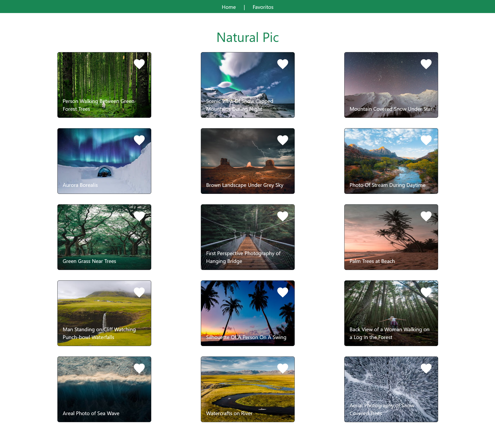
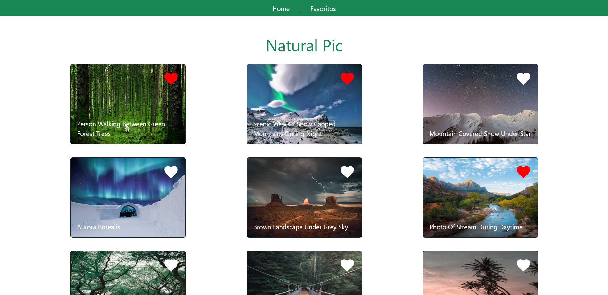
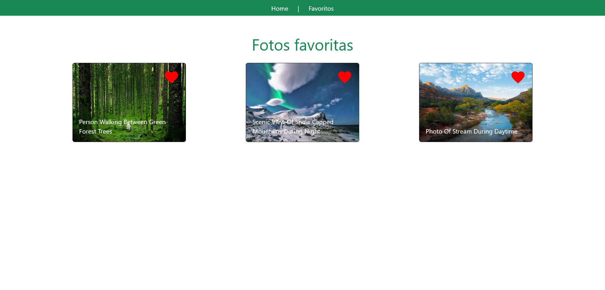

# Desafío - Natural Pic

En este desafío, se me ha solicitado desarrollar Natural Pic, una plataforma dedicada a fotógrafos. Mi tarea será desarrollar el sistema de likes utilizando Context API para gestionar el estado global de la aplicación y React Router para crear las vistas de inicio (Home) y favoritos. 

## Capturas de Pantalla 🖼️

### Home


### Fotos con Likes en Home


### Vista Favoritos


## Requerimientos del Desafío 🎯

1. **Crear un contexto con Context API que se pueda importar desde cualquier componente de la aplicación.**

2. **Usar el contexto creado como un componente para envolver toda la aplicación.**

3. **Asignar como valor del Provider un estado creado con el hook useState.**

4. **Hacer uso del hook useContext para acceder al estado global desde los componentes que lo necesiten.**

## Código Relevante 🧩

### Contexto PicsContext

El contexto PicsContext se utiliza para manejar el estado global de las fotos y la funcionalidad de marcar y desmarcar favoritos.

```javascript
// Archivo: PicsContext.js

import { createContext, useEffect, useState } from 'react'

export const PicsContext = createContext()

const PicsProvider = ({ children }) => {

  const [pics, setPics] = useState([])

  const getData = async () => {
    const url = "/photos.json"
    const response = await fetch(url)
    const data = await response.json()
    setPics(data.photos)
  }

  useEffect(() => {
    getData()
  }, [])

  const handleFavoritePic = (id) => {
    const newPics = pics.map(pic => {
      if (pic.id === id) {
        return {
          ...pic,
          liked: !pic.liked
        }
      }
      return pic
    })
    setPics(newPics)
  }

  const globalState = { pics, handleFavoritePic }

  return (
    <PicsContext.Provider value={globalState}>
      {children}
    </PicsContext.Provider>
  )
}

export default PicsProvider
```

### Componente IconHeart

El componente IconHeart se encarga de mostrar un icono de corazón que cambia de color cuando se marca como favorito.

```javascript
// Archivo: IconHeart.js

import { useContext } from "react";
import { PicsContext } from "../context/PicsContext";

const IconHeart = ({ filled, pic }) => {

  const { handleFavoritePic } = useContext(PicsContext)

  return (
    <svg
      width="40px"
      viewBox="0 0 24 24"
      className="align-self-end"
    >
      <path
        onClick={() => handleFavoritePic(pic.id)}
        fill={filled ? "red" : "white"}
        d="M12,21.35L10.55,20.03C5.4,15.36 2,12.27 2,8.5C2,5.41 4.42,3 7.5,3C9.24,3 10.91,3.81 12,5.08C13.09,3.81 14.76,3 16.5,3C19.58,3 22,5.41 22,8.5C22,12.27 18.6,15.36 13.45,20.03L12,21.35Z"
      />
    </svg>
  );
};

export default IconHeart;
```

### Vista de Favoritos

La vista de Favoritos muestra las fotos marcadas como favoritas utilizando el contexto PicsContext.

```javascript
// Archivo: Favorites.js

import { useContext } from "react";
import { PicsContext } from "../context/PicsContext";
import IconHeart from "../components/IconHeart";

const Favorites = () => {

  const { pics } = useContext(PicsContext)

  return (
    <div className="favorites-container text-center my-5">
      <h1 className="text-success">Fotos favoritas</h1>
      <div className="container text-start">
        <div className="row">
          {pics && pics.filter(pic => pic.liked === true).map(pic =>
            <div key={pic.id} className="col-sm-12 col-md-6 col-lg-4 my-3 d-flex justify-content-center">
              <div className="card text-bg-dark" style={{ width: "18rem", height: "100%" }}>
                
                <div className="card-img-overlay d-flex flex-column justify-content-between">
                  <IconHeart filled={pic.liked} pic={pic} />
                  <p className="card-text">{pic.alt}</p>
                </div>
              </div>
            </div>
          )}
        </div>
      </div>
    </div>
  );
};

export default Favorites;
```

## Tecnologías Utilizadas 💻

- React
- React Router
- Context API

## Estructura del Código 🧱

El código de la aplicación está estructurado utilizando React, con componentes individuales para la página de inicio, la vista de favoritos y el manejo del estado global con Context API. Se ha utilizado React Router para la navegación entre las diferentes vistas de la aplicación.

## Mejoras Futuras 🚀

Para futuras iteraciones de la aplicación, se podría considerar agregar funcionalidades adicionales como la visualización detallada de cada foto, la posibilidad de guardar fotos favoritas en una base de datos y la implementación de un sistema de autenticación para usuarios.
